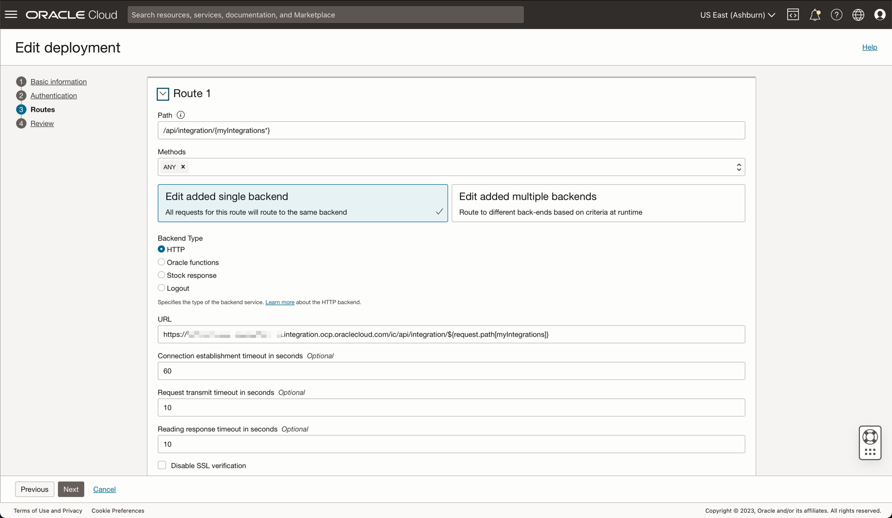

# Introduction

Oracle Integration is an enterprise connectivity and automation platform designed to quickly modernize applications, business processes, APIs, and data. Developers and business IT teams can connect to any SaaS and on-premises applications six times faster using a visual development experience, embedded best practices, and prebuilt integrations for Salesforce, Snowflake, Workday, and more.

You can use Oracle Integration documentation to create a Disaster Recovery architecture to guarantee integrations work properly if a region goes down. It means if OIC in the main region has not been working, the disaster mechanism will guarantee an OIC in another region. It can be done creating two instances of OIC, one in main region and another in the disaster recovery region. See this article to know more how to implement the solution: [Oracle Integration Disaster Recovery](https://docs.oracle.com/en/cloud/paas/integration-cloud/disaster-recovery/disaster-recovery-integrations.html#GUID-A5319115-2B0F-40EC-87C0-30A527B58A09)

This article shows a manual switch from one region to another region, updating the DNS Zone Record value. You can change the endpoint from main OIC to the disaster recovery endpoint.

In this article, you can implement an automation to change from one region to another doing a health-check. If the health-check mechanism identifies the main OIC is not working, the solution will change the DNS Record Zone endpoint. If the main OIC is OK, then the solution changes the endpoint configuration to the main region again.

OCI has the Health-Check functionality, but there is some problems to use this approach:

- OCI Health-Check does not work with private endpoints
- OCI Health-Check can use functions to implement a code to change the DNS Zone Record automatically, but you will have problems with the mechanism to turn back to the main region. You will need to implement a assynchronous mechanism to change back to the main zone

What can we do?

We will implement an OIC integration that will execute periodically (schedule integration) a health-check and changes to the DNS Zone Record. There is a lot of REST API services on OCI, and DNS Zone has services to complete the objectives.

First, we need to execute a call to some main OIC endpoint to verify the health of the instance. You can create a simple OIC REST integration in main side. In the DR OIC side, you need to implement the solution.

Here is the steps to implement:

- Build an OIC integration in the DR environment that will automatically switch to disaster and return to the main region
- Create an OIC integration with schedule (timing for the desired health-check period) in the DR environment
- The integration must make a request to the main environment's OIC apigateway (it can be to any OIC endpoint that does not cause excessive latency)
- This request must be made directly to OIC or API Gateway deployment. I recommend to use API Gateway 
- If the request is successful, check if the DNS Zone is pointing to the main environment
- If not pointing to the main environment, perform a REST call to the DNS Zone and change to the main environment data
- If the request is unsuccessful, perform a REST call to the DNS Zone and change to the DR environment data

Comments:
- The OIC of the DR environment will have access to the private subnet of the load-balancer of the MAIN environment through connectivity between regions via peering
- The OIC of the DR environment will have access to the endpoint through an AGENT OIC especially for this purpose

# Prerequisites

You must have an understanding of how to:

- Provision and configure Oracle Integration instances
- Provision and configure Oracle API Gateways
- Configure DNS Zone and network resources

## Task 1: Create an Oracle API Gateway for each Oracle Integration Instance

Create Oracle API Gateway for each Oracle Integration Instance. 
To create an Oracle API Gateway instance, follow this official documentation [Create an API Gateway](https://docs.oracle.com/en-us/iaas/Content/APIGateway/Tasks/apigatewaycreatinggateway.htm).

In fact, you don't need to create an API Gateway instance, but there is a several benefits in using API Gateway and OIC together:

- Use mTLS for requesting of implemented OIC REST services
- Configure throttling and time-out on your APIs
- Improve authentication and authorization

In the Oracle API Gateway, deploy an API using these steps:

    1. Create 1 Oracle API Gateway for 1 Oracle Integration Instance.

    2. For each Oracle API Gateway, create 1 deployment for the corresponding Oracle Integration Instance.

    3. You don't need to configure security in Oracle API Gateway, the default security will be the Oracle Integration.

        API Parameters
        - Path Prefix: /ic
        - Path: /api/integration/{myIntegrations*}
        - Methods: ANY
        - HTTP: https://oic-xxxxxxxxxxxxxx.integration.ocp.oraclecloud.com/ic/api/integration/${request.path[myIntegrations]}, where oic-xxxxxxxxxxxxxx.integration.ocp.oraclecloud.com = Corresponding Oracle Integration endpoint for each Oracle $

>**Note**: Complete this configuration for each Oracle API Gateway.

## Task 2: Change DNS Zone Records to point to API Gateway IP address

